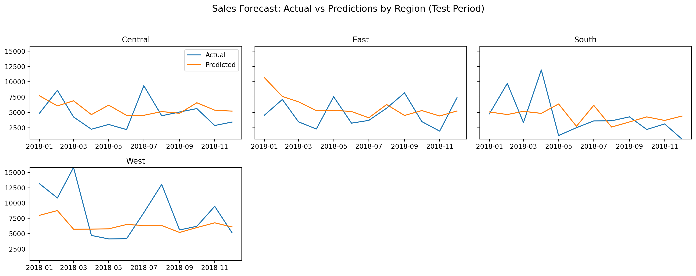

# Sales Forecast Dash

This project focuses on forecasting retail sales and presenting the results through an interactive dashboard.
The dataset comes from Kaggle: “Sales Forecasting” by Rohit Sahoo.

Dataset link: [https://www.kaggle.com/datasets/rohitsahoo/sales-forecasting](https://www.kaggle.com/datasets/rohitsahoo/sales-forecasting)

---

## Preview of Results

**Historical Monthly Sales Performance (EDA)**


**Model Comparison – Central Region**


**Forecast vs Actuals by Region**


---

## Project Objectives

* Clean and explore raw sales data
* Develop baseline and machine learning forecasting models
* Build an app to visualize trends and predictions

---

## Repository Layout

```
Sales-Forecast-Dash/
├─ .ipynb_checkpoints/
├─ .venv/
├─ app/
├─ assets/
├─ data/
├─ models/
├─ notebooks/
├─ src/
├─ .gitignore
├─ README.md
├─ requirements.lock.txt
└─ requirements.txt
```

---

## Getting Started (Windows)

1. **Clone the repository**

```
cd "C:\Users\Jaime\Projects"
git clone https://github.com/jaimetarantola/Sales-Forecast-Dash.git
cd Sales-Forecast-Dash
```

2. Set up a virtual environment

```
py -m venv .venv
.venv\Scripts\activate
```

3. Install the required packages

```
pip install --upgrade pip
pip install -r requirements.txt

# requirements.txt contains a **minimal, clean list** of top-level libraries with version ranges.
# For exact reproducibility, install from the lock file:
pip install -r requirements.lock.txt
```

4. Register the virtual environment with Jupyter

```
python -m ipykernel install --user --name=.venv --display-name "Python (.venv)"
```

5. Launch Jupyter Lab

```
jupyter lab
```

6. Add the raw data

```
Sales-Forecast-Dash\data\raw\
```

7. Run the app (not complete yet)

```
py App\app.py
```
